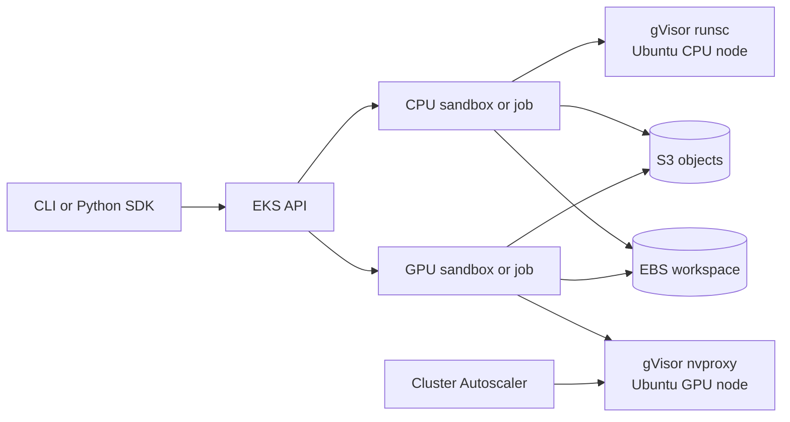

# gVisor Sandbox on AWS EKS

Run reusable AI-agent sandboxes and batch jobs on Amazon EKS. CPU workloads use
gVisor (`runsc`) for an additional userspace-kernel isolation boundary. GPU
workloads run on autoscaled Ubuntu NVIDIA nodes through gVisor's
`nvproxy`, which exposes an allowlisted NVIDIA driver interface without giving
the container the host kernel ABI.

> [!IMPORTANT]
> gVisor materially reduces the host attack surface; it is not a perfect
> security boundary. GPU jobs still reach the host NVIDIA kernel driver through
> nvproxy. Read the [security policy](SECURITY.md) before accepting hostile or
> multi-tenant workloads.

## Highlights

- Kubernetes 1.36 on Canonical Ubuntu 24.04 LTS worker nodes.
- CPU sandboxes isolated with a pinned, checksum-verified gVisor release.
- NVIDIA L4 GPU workloads isolated with gVisor nvproxy, GPU Operator, and
  scale-from-zero.
- Reusable sandboxes, synchronous jobs, and detached jobs from one Python API
  and CLI.
- Optional persistent EBS workspaces and IRSA-authorized S3 object storage.
- Restricted EKS endpoint, private workers, encrypted storage, control-plane
  and VPC flow logs, network policy, seccomp, and restricted pod privileges.
- Terraform lockfile, automated acceptance tests, CI, Dependabot, and PyPI
  Trusted Publishing workflow.

## Architecture



The CPU pool keeps one node online for system services. The GPU pool starts at
zero and scales up when a pod requests `nvidia.com/gpu` with the configured
accelerator label. Runtime `auto` selects `gvisor` for CPU and
`gvisor-nvproxy` for GPU. Native GPU execution is opt-in with
`--runtime native` and is only appropriate for trusted compatibility jobs.

## Quick start

Prerequisites: AWS CLI v2, Terraform, kubectl, Python 3.10+, an AWS role allowed
to create EKS/VPC/IAM/EC2 resources, and regional `g6.xlarge` quota.

```powershell
aws login
.\scripts\deploy.ps1
```

For a non-interactive Terraform approval:

```powershell
.\scripts\deploy.ps1 -AutoApprove
```

Linux or macOS:

```bash
aws login
bash scripts/deploy.sh
```

The deployment helper restricts the EKS public endpoint to your current `/32`,
applies Terraform, configures kubeconfig, installs the package, and runs
self-cleaning CPU/gVisor, EBS, S3/IRSA, autoscaling, and CUDA acceptance tests.
It creates billable AWS resources and can take tens of minutes.

Create a CPU sandbox:

```powershell
gvisor-sandbox create my-agent --ebs-size 8
gvisor-sandbox exec my-agent -- python --version
```

Create an autoscaled NVIDIA L4 sandbox:

```powershell
gvisor-sandbox create gpu-agent `
  --gpu-type nvidia-l4 `
  --image pytorch/pytorch:2.7.1-cuda12.8-cudnn9-runtime `
  --cpu 2 --memory 8Gi --timeout 2400

gvisor-sandbox exec gpu-agent -- `
  python -c "import torch; print(torch.cuda.get_device_name(0))"
```

## Documentation

- [User guide](docs/user-guide.md): installation, deployment, CLI, Python API,
  GPU autoscaling, storage, lifecycle, costs, and troubleshooting.
- [Operations runbook](docs/operations.md): acceptance, monitoring, backups,
  upgrades, and incident response.
- [Security policy](SECURITY.md): supported versions, vulnerability reporting,
  and trust boundaries.
- [Contributing](CONTRIBUTING.md): development checks and pull-request rules.
- [Release guide](docs/releasing.md): build, tag, PyPI, and GitHub release steps.
- [Changelog](CHANGELOG.md): version history.

## Install only the client

```bash
python -m pip install .
gvisor-sandbox --help
```

The client requires a compatible Kubernetes cluster. Installing the package
does not create AWS infrastructure; use the Terraform deployment first.

## Development

```bash
python -m pip install -e ".[dev]"
ruff check .
mypy src
pytest --cov=gvisor_sandbox --cov-fail-under=35
terraform -chdir=terraform fmt -check -recursive
terraform -chdir=terraform init -backend=false -lockfile=readonly
terraform -chdir=terraform validate
```

## Project status

Version 0.5.0 is a release candidate. Local lint, typing, tests, Terraform
validation, and package checks are automated. Maintainers must run the AWS
acceptance test in a clean or explicitly approved test account before each
release. This is not a complete hostile multi-tenant service: operators must
add tenant-specific IAM, Kubernetes RBAC, quotas, and account/cluster isolation
appropriate to their threat model.

## License

MIT License. See [LICENSE](LICENSE).
